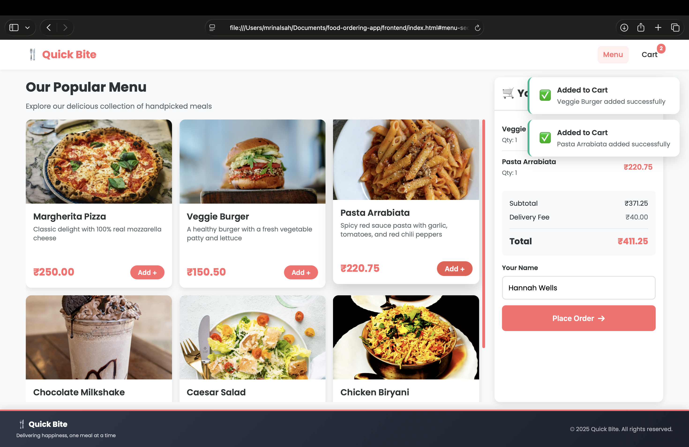

# Quick Bite - Online Food Ordering App

## Overview

Quick Bite is a full-stack food ordering application that allows users to browse menu items and place food orders online.

## Application Preview

## Features

* View available menu items
* Place food orders
* Store orders in a MySQL database
* REST API built with Express.js
* Simple and responsive user interface

## Tech Stack

* Node.js
* Express.js
* MySQL
* HTML
* CSS
* JavaScript

## Project Structure

backend/ - Express backend and API

frontend/ - User interface

database/ - MySQL schema and sample data

## Installation

1. Clone the repository

2. Install backend dependencies

npm install

3. Create a .env file using .env.example

4. Import database/schema.sql into MySQL

5. Start the backend server

npm start

6. Open frontend/index.html in your browser

## Author

Mrinal Sah
